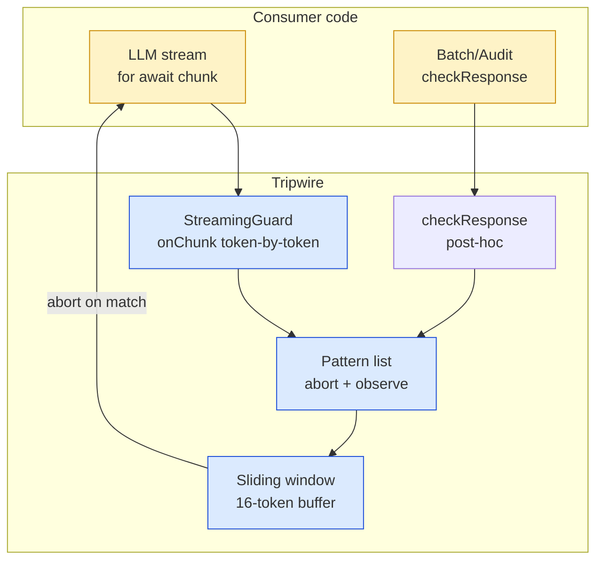
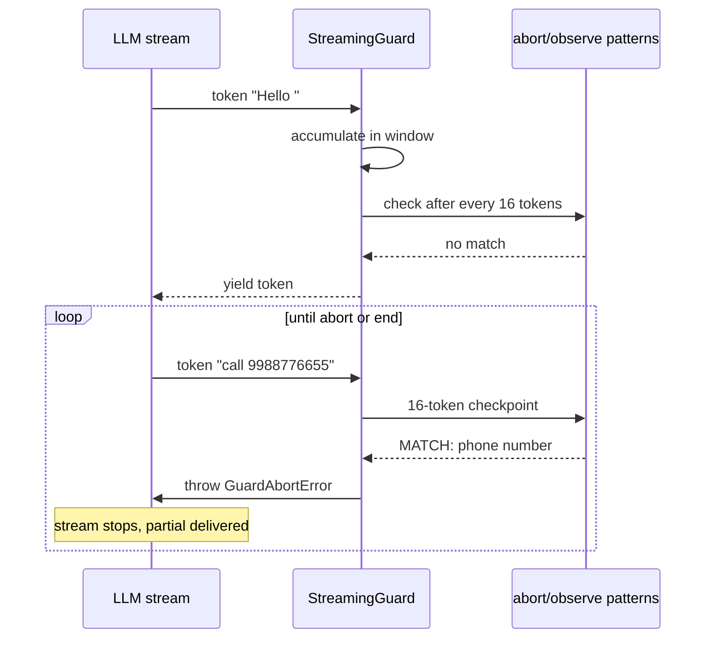
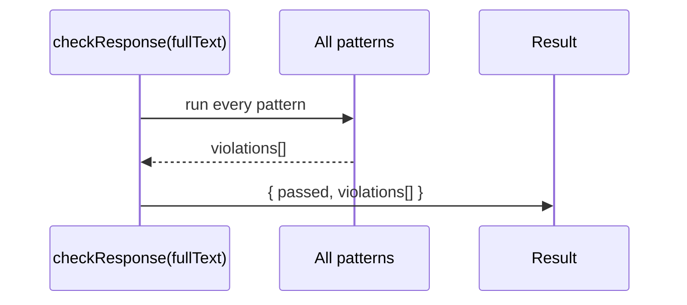

# Architecture — Tripwire

> Detailed design: [docs/architecture.md](docs/architecture.md)

## Component diagram

## Two modes

### Streaming Guard (real-time)

### Post-hoc check

## Module map

| Module | File | Purpose |
|---|---|---|
| Streaming guard | `src/streaming/index.ts` | Wraps token generator, accumulates 16-token window, fires on abort match |
| Guard factory | `src/streaming/index.ts:createStreamingGuard` | Creates guard with `onAbort` + `onViolate` callbacks |
| Pattern registry | `src/patterns/index.ts` | Hard-abort + soft-observe pattern definitions |
| Post-hoc checker | `src/check/index.ts` | Runs all patterns against completed text |
| Types | `src/types.ts` | `GuardAbortError`, `Violation`, `PatternMatch` |

## Key design decisions

1. **16-token sliding window** — Hard abort fires when accumulated text crosses a pattern match. Smaller window misses violations that span chunks; larger adds latency. 16 tokens is the minimum viable window for phone numbers (10 digits) + context.

2. **Abort throws, observe logs** — `onAbort` throws immediately and stops iteration. The consumer's `try/catch` handles the partial delivery. `onViolate` logs and continues — the stream keeps going.

3. **Partial delivery guarantee** — When abort fires, the user sees whatever was already yielded to them. The consumer's stream loop catches `GuardAbortError`, breaks the loop, and returns the `delivered` string. No silent failure.

## Out of scope

- Multi-language pattern support (English-focused regexes)
- Non-phone contact methods (Discord handles, Telegram usernames)
- Dynamic pattern loading at runtime (static pattern list baked in)
- Integration with specific LLM provider SDKs (generic async iterable interface)