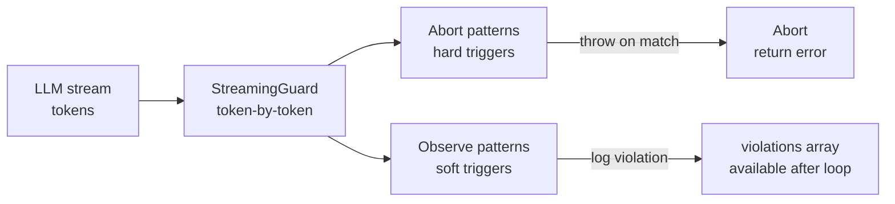

# Tripwire

**Mid-stream LLM safety. Catch the lie before the user finishes reading it.**

A regex/policy guard that watches an LLM token stream and aborts the response the moment a rule trips. Post-hoc audit mode also available for batch reviews.

---

## The problem

LLM streams are all-or-nothing — once you start yielding tokens, you're committed. A model that invents a non-existent project name, commits a fake discount, or leaks a placeholder like `{{PRICE}}` has already delivered the lie. Tripwire lets you stop it mid-sentence.

---

## How it works



**StreamingGuard** — wraps an async token generator. Calls `onChunk(token)` on each token, checks accumulated text against pattern list, throws immediately on hard-abort match.

**Post-hoc check** — `checkResponse(text)` runs all patterns against a completed response. Returns violations without throwing.

**Patterns included:**

| Pattern | Mode | What it catches |
|---|---|---|
| `{{PLACEHOLDER}}` vars | abort | Unfilled template variables in output |
| Business entity leaks | abort | Non-existent project/builder names |
| Contact info | abort | Emails, phone numbers in response |
| Markdown artifacts | observe | Triple-backtick blocks in non-code context |
| Price manipulation | abort | Fabricated discounts or commission claims |

---

## Usage

**Streaming guard (real-time):**

```typescript
import { createStreamingGuard } from '@ykstormsorg/tripwire'

const guard = createStreamingGuard({
  onAbort: (violation, pattern) => {
    throw new Error(`[TRIPWIRE] ${violation}`)
  },
  onViolate: (violation, pattern) => {
    console.warn(`[observe] ${violation}`)
  }
})

for await (const token of llmStream) {
  guard.onChunk(token) // throws mid-stream on abort pattern
  yield token
}
```

**Post-hoc audit (batch):**

```typescript
import { checkResponse } from '@ykstormsorg/tripwire'

const result = checkResponse(llmResponseText)
if (result.violations.length > 0) {
  console.log('Violations:', result.violations)
}
```

---

## Stack

| Layer | Choice |
|---|---|
| Runtime | Node.js 18+ |
| Types | TypeScript |
| Build | tsup |
| Tests | Vitest |
| License | Apache 2.0 |

~762 LOC. No runtime dependencies.

---

## What's NOT here

- **No LLM-judge layer.** Tripwire uses regex patterns, not a secondary model. It won't catch semantically equivalent lies that don't match a pattern.
- **No false-positive rate published.** The abort threshold is tunable per pattern but no production hit/miss data is public.
- **No per-user policy store.** Policies are global — if you need user-specific rules, you need a wrapping layer.
- **Single-tenant in-process use.** Designed as a library imported into your API, not a standalone microservice with a policy DB.

---

## Try locally

```bash
git clone https://github.com/ykstorm/tripwire.git
cd tripwire
npm install
npm test        # 2 test suites
npm run build   # produces dist/index.js + dist/index.mjs
```

---

## License

Apache 2.0 — see [LICENSE](LICENSE).
