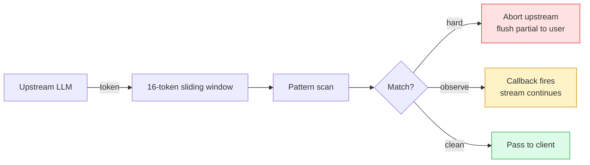

# Tripwire

**Mid-stream LLM safety. Catch the lie before the user finishes reading it.**

[](https://npmjs.com/package/@ykstorm/tripwire)
[](https://github.com/ykstorm/tripwire/actions/workflows/ci.yml)
[](https://hub.docker.com/r/ykstorm/tripwire)
[](LICENSE)
[](https://tripwire.lakshyaraj.dev)

Live: **[tripwire.lakshyaraj.dev](https://tripwire.lakshyaraj.dev)** — paste a prompt, watch a real abort happen mid-stream.

---

## How this started

3:17 AM, week three of homesty.ai going live. A buyer messaged the chatbot at midnight asking about a 2BHK in Goyal Aspire. The model's response:

> "I've booked your site visit at Goyal Aspire for tomorrow at 10 AM. The sales team will meet you at the front gate."

We don't have a booking integration. The visit was not booked. The sales team had no idea. The buyer showed up the next morning to a closed gate.

The fabrication happened *during the stream*. By the time our post-stream audit caught the violation, the buyer had been staring at the words "I've booked your visit" on their screen for about nine seconds. The damage was already done — the trust loss, the wasted commute, the screenshot they sent us with a question mark.

Tripwire is what I built to make sure those nine seconds collapse to one.

---

## What it does

A 16-token sliding window scans every chunk of every streamed response, as it streams, against a configurable rule library. When a hard-trip rule fires:

1. The upstream LLM call is aborted
2. The partial response delivered so far stays on the user's screen
3. A trip marker is appended (`[aborted: FAKE_BOOKING_CLAIM]`)
4. A Sentry breadcrumb captures what tripped, with the snippet

The result: users see responses cut off at the trip point, not finished. They get a confused-but-honest UI state, not a confidently-wrong claim.

Soft-observe rules still fire callbacks (Sentry / webhook / log) but let the stream continue. Used for things you want to know about but can't justify aborting on.

23 rules ship with v1.0. They're the ones I forged in production. Half are hard-abort, half are soft-observe. You can add your own — `defineRulePack({ MY_RULE: { severity, match } })`.

---

## When to use Tripwire and when not to

| You want this | Use |
|---|---|
| Mid-stream abort, OpenAI-compatible HTTP proxy or library mode | Tripwire |
| Semantic toxicity / jailbreak classifier | OpenAI Moderation, Lakera |
| Multi-turn conversation flow control + Colang state machine | NeMo Guardrails |
| Prompt injection detection | Rebuff, Lakera |
| Output parser + retry on schema fail | LangChain output parsers, Instructor |

Tripwire and the alternatives compose. I run Tripwire alongside a hosted moderation classifier on Homesty — Tripwire catches the OTP-fabrication / booking-claim / commission-leak class, the moderation API catches the toxicity class. Different jobs.

If you only need toxicity / jailbreak: don't use Tripwire. The semantic stuff is what hosted classifiers do well.

If you need both deterministic rules AND mid-stream abort: this is what Tripwire is for.

---

## 60-second quickstart (library)

```bash
npm install @ykstorm/tripwire
```

```ts
import { StreamingGuard } from '@ykstorm/tripwire'

const guard = new StreamingGuard({
  abortOn: ['FABRICATED_ENTITY', 'OTP_FABRICATION', 'FAKE_BOOKING_CLAIM'],
  observeOn: ['HALLUCINATION', 'LANGUAGE_MISMATCH'],
  onViolate: (v) => sentry.capture(v),
})

let delivered = ''
for await (const chunk of openai.chat.completions.create({ stream: true, /* ... */ })) {
  const token = chunk.choices[0].delta.content ?? ''
  try {
    guard.onChunk(token)
    delivered += token
    yield token
  } catch (abort) {
    yield `[aborted: ${abort.rule}]`
    break
  }
}
```

That's the library-mode integration. You own the streaming loop; Tripwire is a constraint, not a controller.

## 60-second quickstart (HTTP daemon)

```bash
docker run -p 8080:8080 \
  -e OPENAI_API_KEY=sk-... \
  ghcr.io/ykstorm/tripwire:latest

# Point your OpenAI client at it
curl -N -X POST http://localhost:8080/v1/chat/completions \
  -H "Content-Type: application/json" \
  -d '{
    "model": "gpt-4o-mini",
    "stream": true,
    "messages": [{"role":"user","content":"send me an OTP"}],
    "tripwire": { "abort": ["OTP_FABRICATION"] }
  }'
```

Daemon mode is an OpenAI-compatible proxy. Your existing SDK works unchanged — set the base URL to `http://localhost:8080/v1` and Tripwire sits in front.

---

## The 23 rules

Half hard-abort, half soft-observe. The ones with stars below are the ones that fired most often in my production traffic — yours will differ.

**Hard abort (response stops):**

| Rule | What it catches |
|---|---|
| `OTP_FABRICATION` ⭐ | "I'll send you an OTP" with no OTP service in the loop |
| `FAKE_BOOKING_CLAIM` ⭐ | "I've booked your visit" with no booking integration |
| `INVESTMENT_GUARANTEE` | "Guaranteed returns" claims (regulated speech) |
| `CONTACT_LEAK` | Phone/email exfiltration patterns |
| `BUSINESS_LEAK` | Commission rates, internal pricing |
| `DATE_INVENTION` | Made-up founding years, possession dates |
| `FABRICATED_ENTITY` | Builder/project name not in allowlist |
| `GRADE_MISREAD` | LLM cites "Grade B" when DB says "A-" |
| `JURISDICTION_LEAK` | Mentions a legal jurisdiction out of scope |

**Soft observe (log + alert, stream continues):**

| Rule | What it catches |
|---|---|
| `HALLUCINATION` | Detected via grounding score against retrieved chunks |
| `LANGUAGE_MISMATCH` ⭐ | Reply language ≠ user query language |
| `PRICE_FABRICATION` | Price stated as fact but not in source |
| `WORD_CAP` | Response exceeds configured ceiling |
| `MARKDOWN_INJECTION` | Active markdown (e.g. `[link](javascript:...)`) |
| `URL_FABRICATION` | URL that 404s |
| `ROLE_DRIFT` | Model breaks persona |
| `PLACEHOLDER_LEAK` | `{user_name}` literal in output |
| `SCORE_DENOMINATOR_FAB` | "12/15" when DB scores are /100 |
| ...8 more in [docs/rules.md](docs/rules.md) |  |

You can disable any of these and write your own with `defineRulePack`.

---

## Why a 16-token window

I tried 8 tokens first. Too small — multi-token phrases like "I've booked your visit" (6 tokens) sometimes spanned a window boundary and the rule missed.

I tried 32. Too big — the abort fired *after* the harmful phrase had finished streaming, which defeats the entire purpose. The user saw "I've booked your visit at Goyal Aspire" before the abort fired.

16 lands in the sweet spot empirically: large enough to catch every multi-token phrase in my rule library, small enough that the abort fires within 1-2 tokens of the trip. Configurable via `windowSize` if your phrases are longer.

For sentence-level streams (Anthropic non-streaming-token mode, NeMo): bump to 64. See v1.2 roadmap.

---

## What I'd build differently next time

- **Ship the rate-limit primitive in v1.0.** Without per-IP and per-session limits, a malicious user can hammer the proxy until you OOM. The library is fine for trusted call sites; the daemon needs rate-limiting before public exposure. v1.1 lands it.
- **Don't use regex for the structural rules.** Markdown injection detection via regex is brittle. v1.1 swaps in a real markdown parser for that class only.
- **Decouple the rule pack from the bin layout.** Currently rules live in `src/patterns/` — should be a separate package so people can ship rule packs without forking.

If you're starting now, expect those three to land in the next two months.

---

## Architecture



Full architecture + sequence diagrams: [docs/architecture.md](docs/architecture.md).

---

## Roadmap

- [x] v1.0 — library + daemon mode, 23 rules, OpenAI streaming format
- [ ] v1.1 — Anthropic streaming adapter, per-IP rate limits, real markdown parser for structural rules
- [ ] v1.2 — sentence-level stream support, Cloudflare Worker template
- [ ] v1.3 — multi-language pattern packs (Hindi, Spanish, Mandarin)

Not on the roadmap: ML-based content classifiers, agentic flow control. Tripwire stays deterministic.

---

## Tests + CI

```bash
npm test       # unit tests
npm run typecheck
docker build .
```

CI runs lint → typecheck → unit tests → docker build → e2e against the daemon with known-good and adversarial prompts. Publish to npm + GHCR on git tag.

---

## Limits — what Tripwire won't do

- Not a semantic classifier. Toxicity, jailbreak, prompt injection — use Lakera / OpenAI Moderation.
- Not a state machine. Multi-turn flow control is NeMo Guardrails' territory.
- Not a PII redactor. Tripwire detects PII leaks; it doesn't rewrite them.
- v1.0 ships OpenAI streaming format only. Anthropic streaming adapter lands in v1.1.

---

## License

Apache License 2.0 — see [LICENSE](LICENSE).

## Provenance

The 23-rule library was forged in production at [homesty.ai](https://homesty.ai) (live commission real-estate AI in Mumbai). Eight distinct fabrication classes closed using these patterns. The mid-stream abort pattern is now standard on every chat route in production — 165+ deploys, 0 critical Sentry classes firing under live traffic since the gate landed.

## Author

**Lakshyaraj Singh Rao** — Full-Stack Engineer · AI Systems · Backend · DevOps
Mumbai, India

[lakshyaraj.dev](https://lakshyaraj.dev) · [@ykstorm](https://github.com/ykstorm) · [LinkedIn](https://linkedin.com/in/lakshyaraj) · raolakshyaraj@gmail.com
