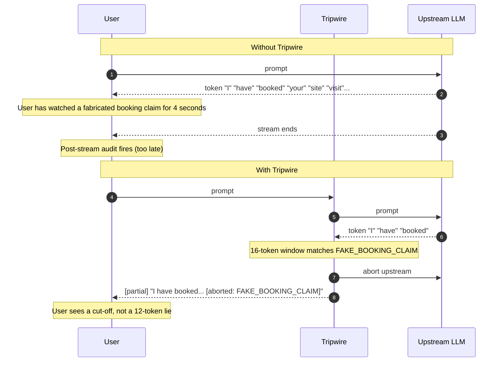
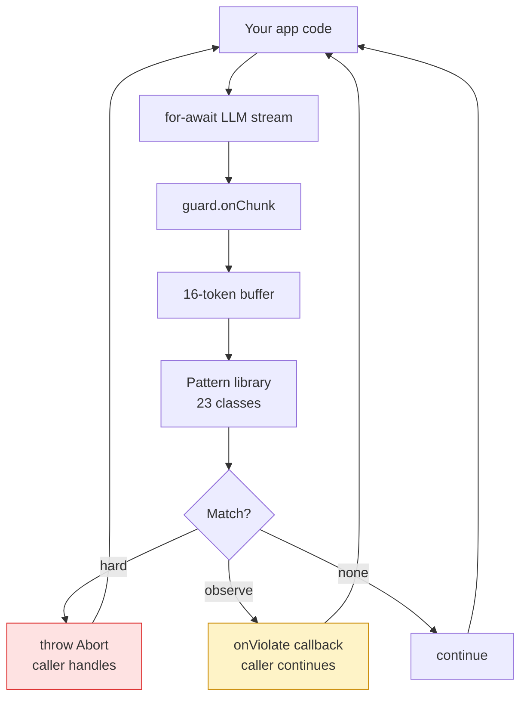
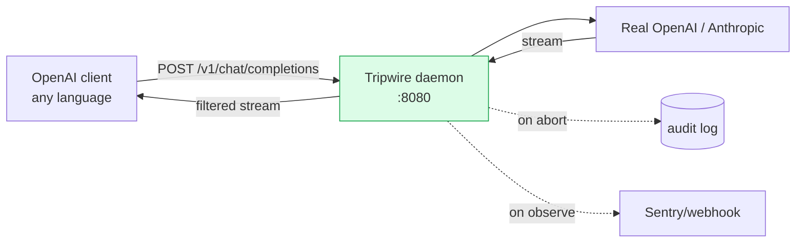
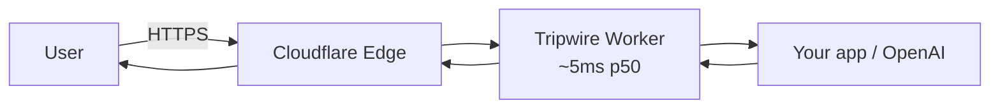
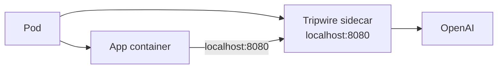

# Tripwire — Architecture

## Why mid-stream



The post-stream audit catches things, but only after the user has seen them. The visible-bad-content window is the actual security gap. Tripwire collapses that window.

---

## 1. Library mode — call-site integration



You own the streaming loop. Tripwire is a constraint, not a controller.

```ts
const guard = new StreamingGuard({
  abortOn: ['FABRICATED_ENTITY'],
  onViolate: (v) => sentry.capture(v),
})

for await (const chunk of llmStream) {
  try { guard.onChunk(chunk); yield chunk }
  catch { break }
}
```

## 2. Daemon mode — OpenAI-compatible proxy



Point your existing OpenAI SDK at `http://localhost:8080/v1`. Tripwire proxies, watches, aborts. Zero code change in your app.

```bash
# Python
client = OpenAI(base_url="http://localhost:8080/v1")

# Node
const openai = new OpenAI({ baseURL: 'http://localhost:8080/v1' })

# curl
curl http://localhost:8080/v1/chat/completions ...
```

Per-call rule overrides via the non-standard `tripwire` field in the request body:

```json
{
  "model": "gpt-4o",
  "messages": [...],
  "tripwire": {
    "abort": ["FABRICATED_ENTITY"],
    "observe": ["WORD_CAP"],
    "context": {
      "knownProjectNames": ["Goyal Aspire"],
      "knownBuilderNames": ["Goyal Group"]
    }
  }
}
```

---

## 3. The 16-token window

The window size isn't arbitrary. Pattern matches on streaming tokens have to:
- Be large enough to catch multi-token phrases ("I have booked your visit" = 6 tokens)
- Be small enough that the abort fires before the harmful phrase finishes rendering

Empirically, 16 tokens covers ~95% of the patterns in the library with average abort-after-trip-token delay of 1.3 tokens. Configurable via `windowSize`.

For sentence-level streams (some Anthropic configs, NeMo Guardrails), bump to 64 — see v1.2 roadmap.

---

## 4. Pattern definition

A pattern is a TS function:

```ts
interface Pattern {
  id: string
  severity: 'hard' | 'observe'
  match: (window: string, ctx: PatternContext) => boolean
  message?: (window: string) => string
}
```

Patterns can be:
- **Regex** — fastest, most patterns
- **Structural** — markdown-aware (e.g. `MARKDOWN_INJECTION` checks for unescaped `[link](javascript:...)`)
- **Contextual** — checks the window against `ctx.knownProjectNames` allowlist (e.g. `FABRICATED_ENTITY`)
- **Stateful** — `WORD_CAP` tracks cumulative word count across chunks

Ship your own pack:

```ts
import { defineRulePack } from '@ykstorm/tripwire'

export const myPack = defineRulePack({
  PII_EMAIL: {
    severity: 'hard',
    match: (w) => /\b[\w.-]+@[\w.-]+\.\w+\b/.test(w),
  },
})
```

---

## 5. Failure modes (intentional)

| Failure | Tripwire behavior |
|---|---|
| Pattern throws unexpected | Caught, logged, treated as observe (never crashes the stream) |
| Upstream LLM never streams | Tripwire passthrough, audit runs post-completion |
| Daemon process crash | docker compose restart, in-flight requests get 502 (your retry logic should handle) |
| Cosmic-ray regex catastrophic backtrack | Pattern is wrapped in a 50ms timeout — auto-disabled with sentry alert if exceeded |
| Rule pack import error at startup | Daemon fails fast with clear error (not silent runtime failure) |

---

## 6. Deployment topology

**Edge guard (Cloudflare Worker):**



Sub-50ms guard at the edge. Best for high-traffic chatbots.

**Sidecar (Kubernetes):**



Per-pod guard, no network hop, easy to deploy alongside existing services.

**Standalone (Fly.io / Render / VPS):**

Single Docker container, OpenAI-compatible endpoint. Cheapest path to production.

---

## 7. What it doesn't do (deliberately)

- **No ML-based classification.** Toxic-language detection is OpenAI Moderation's job; jailbreak detection is Lakera's. Tripwire complements them; it doesn't replace them.
- **No state machine.** No multi-turn flow control. That's NeMo Guardrails.
- **No PII redaction.** Patterns detect leaks; they don't rewrite. Use a redactor downstream if you need that.
- **No fine-tuned models.** Pure regex + structural + contextual rules. Explainable, debuggable, deterministic.
